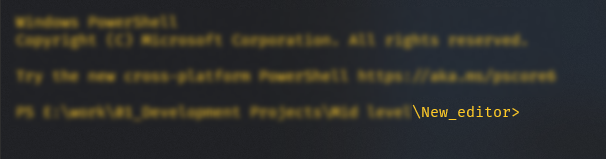
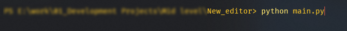

# Text Editor
### This is a Text Editor that allows all the basic functionality in a text editor like notepad. 

## Feedback
### All feedback is welcome. Please share all your thoughts about the app and also features or functionality you would like to see in the future. 
### I know this is a very basic app currently. Please keep in mind, this is my first true app.
### You can email me at hashim.feedback@gmail.com to send your feedback.

## How to run
### You can run the file by double clicking the main.py file. If this does not work, you can run this file through your terminal. 
### Step 01 - Ensure you are in the directory that you have downloaded this file in.

### Step 02 - Type in the terminal **python main.py** and hit enter.

